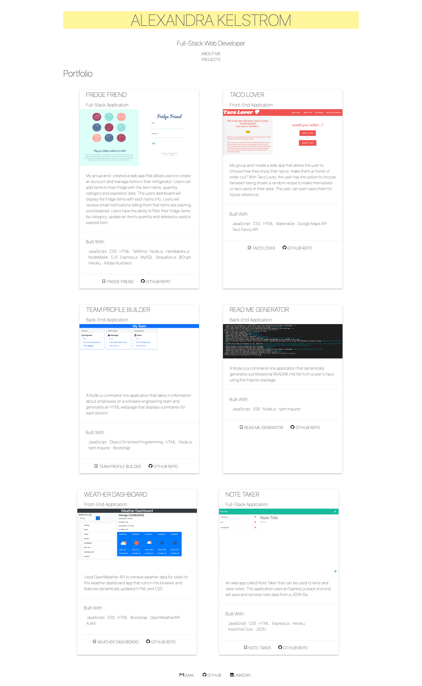

# React Portfolio

## Description
Used React to create a component-based portfolio. I used MaterializeCSS along with vanilla CSS for styling. This Portfolio renders dynamic projects ranging from front-end, back-end and full-stack applications, along with a section about myself. 

This project was bootstrapped with [Create React App](https://github.com/facebook/create-react-app).

## Usage

This site is deployed using Github Pages. Please visit the live site here: [react-portfolio-live](https://akelstrom.github.io/react-portfolio/)

# Credits
Big thanks to the Upenn LPS Coding Bootcamp instructional team for all their support!

# Questions
For any questions, please don't hesitate to contact me by email: [akelstrom@gmail.com](mailto:akelstrom@gmail.com)
